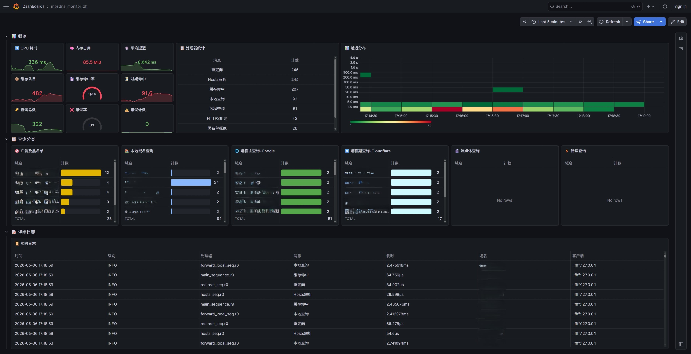

# mosdns — DNS 分流 + Grafana 监控方案

> **代码设计:**：Jerrell &nbsp;|&nbsp; **代码助手**：DeepSeek &nbsp;|&nbsp; **许可**：[GPL v3.0](LICENSE)

基于 [mosdns](https://github.com/IrineSistiana/mosdns) v5 的 DNS 分流部署方案，配合 [OpenClash](https://github.com/vernesong/OpenClash) 实现零泄露代理。通过 Docker Compose 一键部署 Loki + Prometheus + Grafana 监控栈，提供 DNS 查询日志采集、实时指标监控和汉化可视化面板。

---

## 重要：关于 DNS 泄露测试（仅个人理解及AI分析所得，风险自判）

网络上流行的 DNS 泄露测试网站（ipleak.net、dnsleaktest.com、whoer.net）普遍采用**钓鱼式检测**：

1. 生成一个随机子域名（如 `abc123.leaktest.com`）
2. 将该域名解析到一个**中国 IP**（如广东电信 `163.177.x.x`）
3. 浏览器连接该 IP → GeoIP 直连 → ISP 出口 IP 暴露
4. 测试站拿着 ISP IP 报告"检测到泄露"

**这不是 DNS 泄露，是 HTTP 路由决策。** Google 不会托管在广东电信的 IP 上，现实中不存在此问题。如果你看到的泄露报告里出现了大陆的这类地址，说明测试站使用了上述方法。

至于国内域名使用运营商 DNS 明文查询的安全问题：ISP 本身就能从 HTTP 连接中看到你访问的国内网站，因此对国内 DNS 加密封装没有实际意义。

> **如果测试站返回了你的 ISP 名称**（而非其他地区运营商）：这是 `forward_local` 中配置的 ISP DNS 服务器被泄露测试站的随机子域名触发。该子域名被 geosite 规则匹配为国内域名，走了 ISP DNS 查询。这不是国外流量泄露，但如果你在意，将 `forward_local` 中所有 ISP DNS 替换为公共 DNS（如 `223.5.5.5`、`119.29.29.29`）即可消除。代价是国内 CDN 解析可能稍慢。

---

### ⚠️ 日志文件溢出风险

mosdns 的日志级别为 `info`，存放于 `/var/log/mosdns.log`。**客户端数量越多、网络使用越频繁，日志膨胀越快。** 路由器 `/var` 分区通常挂载于 tmpfs（内存），日志文件过大将**直接耗尽可用内存**，导致路由器死机或自动重启。

> **强烈建议**配置 crontab 自动清理，将日志大小始终控制在安全范围内。默认阈值为 2MB，每 6 小时检查一次：

```bash
# 添加 crontab（登录路由器执行）
echo '0 */6 * * * mosdns-cli clear 2' >> /etc/crontabs/root
/etc/init.d/cron restart
```

> 也可手动清理：`mosdns-cli clear`（立即清空）或 `mosdns-cli clear 2`（≥2MB 才清）。

---

### ⚠️ Docker 端磁盘占用

| 容器 | 存储 | 限制 |
|------|------|------|
| **Vector** | 无持久化（仅内存缓冲） | 可忽略 |
| **Loki** | `loki_data` 命名卷持久化 | **保留 48 小时**，compactor 自动清理过期 chunks |
| **Prometheus** | `prometheus_data` 命名卷 | 默认 15 天，TSDB 自动压缩 |
| **Grafana** | `grafana_data` 命名卷 | 面板配置，几 MB |

Loki 是唯一持续写入的服务。家庭网络（几百客户端）日均约 5-25 MB 原始日志，经 snappy 压缩后约 2-8 MB。48 小时保留 ≈ **20 MB 以内**，`docker compose down && up` 后数据不丢失。

---

## 开始前：关闭浏览器的"安全 DNS"

Chrome / Edge / Firefox 自带 DNS-over-HTTPS 功能，会绕过 mosdns 直接向 8.8.8.8 / Cloudflare 发加密查询，造成 DNS 泄露。部署前务必关闭：

| 浏览器 | 操作路径 |
| ------ | -------- |
| **Chrome** | 设置 → 隐私和安全 → 安全 → 关闭"使用安全 DNS" |
| **Edge** | 设置 → 隐私、搜索和服务 → 安全 → 关闭"使用安全的 DNS 指定如何查找网站的网络地址" |
| **Firefox** | 设置 → 隐私与安全 → 取消"通过 HTTPS 启用 DNS" |

> Edge 如显示"托管浏览器禁用该设置"：地址栏输入 `edge://policy`，搜索 `DnsOverHttps`。若存在 `DnsOverHttpsMode: "secure"`，说明企业策略强制开启了 DoH，需在组策略或注册表中关闭。

---

## 两种部署模式

| 模式 | 配置文件 | 监听端口 | 国外 DNS | 适用场景 |
| ---- | -------- | -------- | -------- | -------- |
| **后端模式** | `config_custom.yaml` | :5335 | Google/Cloudflare DoH | 纯 DNS 分流，通常作为 Clash 后端 |
| **系统前端** | `config_custom_clash.yaml` | :53 | `127.0.0.1:7874` → Clash | mosdns 前置分流，Clash 专注代理 |

核心思路：**国内域名 mosdns 直查以获得最快 CDN，国外域名交由 DoH 或 Clash 解析。**

---

## 架构

```text
OpenWrt 路由器 (192.168.11.1)            Docker 主机 (192.168.11.200)
┌──────────────────────────┐     ┌──────────────────────────────────┐
│  mosdns (:53 或 :5335)   │     │  vector (:9010/UDP)              │
│  ├─ DNS 分流 + 缓存      │     │  ├─ 接收日志 → 解析 → 中文映射    │
│  ├─ Prometheus :8338     │────▶│  └─ 直推 Loki (:3100)            │
│  └─ /var/log/mosdns.log  │     │                                   │
│      │                    │     │  Prometheus (:9090)              │
│      │ socat UDP ─────────┼────▶│  Grafana (:3000)                 │
│      │                    │     └──────────────────────────────────┘
│  mosdns-log (procd)      │
│  tail -f → socat UDP     │
└──────────────────────────┘
```

| 环境 | 要求 |
| ---- | ---- |
| **路由器** | OpenWrt，已安装 mosdns v5 + socat |
| **Docker 主机** | Docker Engine 24+ / Docker Compose v2，与路由器局域网互通 |

| 组件 | 版本 |
| ---- | ---- |
| mosdns | v5 (OpenWrt 端) |
| Vector | `timberio/vector:latest-alpine` |
| Loki | `grafana/loki:3.4.3` |
| Prometheus | `prom/prometheus:latest` |
| Grafana | `grafana/grafana:latest` |

---

## 快速开始

<details open>
<summary><b>第一步：安装 mosdns</b></summary>

```bash
wget https://github.com/IrineSistiana/mosdns/releases/latest/download/mosdns-linux-amd64.zip
unzip mosdns-linux-amd64.zip -d /usr/bin/
chmod +x /usr/bin/mosdns
```

> 如果安装 [luci-app-mosdns](https://github.com/sbwml/luci-app-mosdns)，使用其"GeoData 导出"功能可自动生成规则文件，无需手动下载。

**GeoData 导出标签**：

```
GeoSite: cn, gfw, apple, category-ads-all, geolocation-!cn, disney, hulu, netflix
GeoIP:  cn, private
```

#### 没有 GeoData 时如何先跑起来

如果 GeoData 尚未导出，配置启动会因找不到规则文件而报错。先在两个目录创建所需空文件：

**`/var/mosdns/`**（GeoData 导出后自动覆盖，此处仅为首次启动占位）：

```bash
cd /var/mosdns
touch geosite_cn.txt geoip_cn.txt geosite_apple.txt \
      geosite_geolocation-!cn.txt geosite_category-ads-all.txt \
      geosite_disney.txt geosite_netflix.txt geosite_hulu.txt
```

**`/etc/mosdns/rule/`**（用户自行维护，不会自动生成）：

```bash
cd /etc/mosdns/rule
touch whitelist.txt blocklist.txt greylist.txt ddnslist.txt \
      hosts.txt redirect.txt streaming.txt cloudflare-cidr.txt
```

> 首次启动后尽快运行 `mosdns-cli cf` 将 `cloudflare-cidr.txt` 更新为完整数据，☁️ CF 优选加速面板依赖它。

启动成功后可通过 luci-app-mosdns 的"规则列表"功能在线编辑这些文件。（PTR 黑名单已废弃）

</details>

<details>
<summary><b>第二步：选择并部署配置</b></summary>

```bash
mkdir -p /etc/mosdns/rule /var/mosdns
```

#### 后端模式（mosdns 在后，Clash 在前）

Clash 端 ->插件设置->DNS设置->本地DNS劫持选[使用Dnsmasq转发]，转到覆写设置-> DNS 设置：将 nameserver 和 fallback 均指向 `127.0.0.1:5335`，取消其他 DNS 服务器。`default-nameserver` 设为 `223.5.5.5` 用于节点域名解析。

可在 DNS 覆写中启用 **Nameserver-Policy** 以进一步加速：

```yaml
"geosite:cn,private": [127.0.0.1:5335]
```

```bash
# 从示例配置复制
cp dashboard/mosdns/config/config_custom.yaml.sample my_config.yaml
# 编辑 my_config.yaml — 修改 forward_local 的 DNS 地址
# 重命名并上传
scp my_config.yaml root@192.168.11.1:/etc/mosdns/config_custom.yaml
```

#### 系统前端模式（mosdns 在前，接管 :53）

该模式下 mosdns 负责域名分类，国内直查、国外交 Clash DNS。架构清晰，能显著降低 OpenClash 因频繁处理 DNS 导致的 CPU 瞬时高负载。

**前置条件**：将 dnsmasq 监听端口改为 5335，mosdns 才能绑定 53。同时必须关闭 DNS 重定向，否则客户端 53 端口的查询会被防火墙劫持到旧 dnsmasq，永远到不了 mosdns。

```bash
# 修改 dnsmasq 端口并关闭 DNS 重定向
uci set dhcp.@dnsmasq[0].port='5335'
uci set dhcp.@dnsmasq[0].dns_redirect='0'
uci commit dhcp
/etc/init.d/dnsmasq restart
```

> LuCI 界面操作：网络 → DHCP/DNS → 常规 → **DNS 端口** 改为 5335，**DNS 重定向** 关闭。

```bash
# 部署配置
cp dashboard/mosdns/config/config_custom_clash_sample.yaml my_config.yaml
# 编辑 my_config.yaml — 修改 forward_local 的 DNS 地址和 black_hole IP
scp my_config.yaml root@192.168.11.1:/etc/mosdns/config_custom.yaml
```

> **重要**：luci-app-mosdns 的"自定义配置"功能仅识别 `/etc/mosdns/config_custom.yaml`。无论选择哪种模式，都必须将对应配置文件**重命名为 `config_custom.yaml`** 后上传。配置文件内已包含完整中文注释。

#### 部署前必须修改的两项配置

**① 本地 DNS 地址**——搜索 `forward_local`：

```yaml
  - tag: forward_local
    type: forward
    args:
      concurrent: 2
      upstreams:
        - addr: "223.5.5.5"
        - addr: "119.29.29.29"
        # 替换或追加你的运营商 DNS 以获得最快 CDN
```

`concurrent: 2` 是竞速模式，所有上游并行查询、谁快用谁。越多越快，但不要加国外 DNS。

**② Cloudflare 优选 IP**——搜索 `black_hole`：

```yaml
  - tag: cloudflare_accel
    type: sequence
    args:
      - exec: query_summary cloudflare_accel
      - exec: black_hole 1.1.1.1 2.2.2.2
```

从 [CloudflareSpeedTest](https://github.com/XIU2/CloudflareSpeedTest) 测出你网络最快的几个 IP，替换 `1.1.1.1 2.2.2.2`，用空格分隔。同时需运行 `mosdns-cli cf` 下载完整 CIDR 列表，☁️ CF 优选加速面板才会有数据。

</details>

<details>
<summary><b>第三步：部署日志转发和控制工具</b></summary>

```bash
opkg update && opkg install socat

# 日志转发（procd 管理）
scp dashboard/mosdns/mosdns-log root@192.168.11.1:/etc/init.d/
chmod +x /etc/init.d/mosdns-log

# mosdns 控制工具
scp dashboard/mosdns/mosdns-cli root@192.168.11.1:/usr/bin/
chmod +x /usr/bin/mosdns-cli

# 如 Docker 主机 IP 非 192.168.11.200，需修改
vi /etc/init.d/mosdns-log   # 改 DOCKER_HOST="你的IP"

/etc/init.d/mosdns-log enable
/etc/init.d/mosdns-log start
```

</details>

<details>
<summary><b>第四步：启动 mosdns</b></summary>

```bash
# 命令行启动（用于测试配置格式）
mosdns start -c /etc/mosdns/config_custom.yaml -d /etc/mosdns

# 确认无报错后，推荐改用 luci-app-mosdns "自定义配置"功能启动（勾选"启用"即可）

# 验证
curl http://127.0.0.1:8338/metrics
nslookup baidu.com 127.0.0.1
nslookup google.com 127.0.0.1
```

</details>

<details>
<summary><b>第五步：部署 Docker 监控栈</b></summary>

在 Docker 主机上执行：

```bash
cd dashboard
# 如果 mosdns 不在 192.168.11.1:8338，先修改 docker-compose.yaml 中 PROMETHEUS_TARGET 地址
docker compose up -d
docker compose ps
```

</details>

<details>
<summary><b>第六步：导入 Grafana 面板</b></summary>

1. 浏览器访问 `http://192.168.11.200:3000`
2. Dashboards → New → Import
3. 后端模式上传 `dashboard/panel/panel.json`
4. 系统前端模式上传 `dashboard/panel/panel_clash.json`

两个面板使用不同 UID（`mosdns` 和 `mosdns_clash`），可同时导入，互不覆盖。

</details>

---

## DNS 分流逻辑

main_sequence 按优先级执行 14 步，每步后检查是否有响应：

```
查询进入 → Step 1  指标采集
          → Step 2  黑名单 / PTR / HTTPS → 拒绝
          → Step 3  广告域名 → 拒绝
          → Step 4  hosts 文件 → 本地解析
          → Step 5  redirect → 重定向
          → Step 6  缓存 → 命中则返回
          → Step 7  Apple 域名 → 国内 DNS + 114 备用
          → Step 8  DDNS → 国内 DNS
          → Step 9  白名单 → 国内 DNS
          → Step 10 流媒体 → 专用线路
          → Step 11 灰名单 → 远程 DNS
          → Step 12 国内域名 → 国内 DNS 池
          → Step 13 国外域名 → 远程 DNS
          → Step 14 兜底 → 竞速查询
```

### 两模式上游差异

| 步骤 | 后端模式 | 系统前端模式 |
| ---- | -------- | -------------- |
| 10 流媒体 | Google DoH | Clash DNS + AAAA 拦截 |
| 11 灰名单 | Google + Cloudflare DoH | Clash DNS + AAAA 拦截 |
| 12 国内 | 国内 DNS 池 | 同左 |
| 13 国外 | Google + Cloudflare DoH | Clash DNS + AAAA 拦截 |
| 14 兜底 | Google vs Cloudflare 竞速 | Clash DNS 竞速 + AAAA 拦截 |

> AAAA 拦截仅作用于走 Clash 的路径（步骤 10/11/13/14）。国内 DNS 路径不受影响，IPv6 正常使用。

#### Step 7 Apple 域名工作流

```
Apple 域名 → primary（国内 DNS 查询）
              ├─ 返回国内 IP + <100ms → 直接返回，114 不触发
              ├─ 返回国外 IP        → drop_resp → 114 DNS 接管
              └─ 超过 100ms         → 114 DNS 并行竞速
```

> 后端模式下 `always_standby: true` 并行更好；系统前端模式下 `always_standby: false` 避免 114 明文泄漏。

#### 关闭广告拦截

搜索 `Step 3`，将三行取消注释改回注释：

```yaml
      # Step 3 — 广告域名拦截（按需启用：取消下面三行的注释）
      # - matches: qname $adlist
      #   exec: $reject_adlist
      # - exec: jump has_resp_sequence
```

### 配置对比

| 项目 | config_custom.yaml | config_custom_clash.yaml |
| ---- | ------------------ | ------------------------ |
| 监听端口 | :5335 | :53 |
| 国外 DNS | Google/Cloudflare DoH | `127.0.0.1:7874` |
| IPv4 优先 | ✅ | ✅ |
| AAAA 拦截 | — | ✅ |
| 广告拦截 | ✅ | ✅ |
| Apple 日志 | ✅ | ✅ |
| CF 优选日志 | ✅ | ✅ |

---

## 面板一览

| 面板 | 类型 | 说明 | 适用 |
| ---- | ---- | ---- | ---- |
| 📊 指标仪表 | Prometheus | 查询总数、错误率、缓存命中、CPU 耗时、内存占用 | 两者 |
| 📋 处理器统计 | Loki | 按 message_zh 聚合的查询分布 | 两者 |
| 📊 延迟分布 | Prometheus | 响应时间热力图 | 两者 |
| 🚫 广告及黑名单 | Loki | 被拒绝的域名（黑名单 + 广告域名 + AAAA拦截） | 两者 |
| 🏠 本地域名查询（支持IPV4/IPV6双栈） | Loki | 走国内 DNS 直查的域名 | 两者 |
| 🌐 远程主查询-Google（IPV4优先） | Loki | Google DNS 查询（国外域名、灰名单） | 后端 |
| 🌐 代理查询(仅支持IPV4) | Loki | Clash DNS 查询（国外域名、灰名单） | 系统前端 |
| 🔄 远程副查询-Cloudflare（IPV4优先） | Loki | Cloudflare DNS 竞速兜底 | 后端 |
| 🎬 流媒体查询 | Loki | 流媒体专用线路 | 两者 |
| ⚡ 错误查询 | Loki | forward 插件连接上游失败（超时/TLS/宕机） | 后端 |
| 🍎 Apple 加速域名 | Loki | Apple 域名被 114 DNS 加速的查询 | 系统前端 |
| ☁️ CF 优选加速 | Loki | Cloudflare IP 被替换为优选 IP 的域名 | 系统前端 |
| 📜 实时日志 | Loki | 全量日志流 | 两者 |

---

## 规则验证指南

部署后逐条验证每个规则是否正确触发。以下命令在路由器上执行，面板观察 Grafana → "📜 实时日志" 面板。

**前提**：需先在对应规则文件中写入测试条目（hosts/redirect/whitelist/greylist/ddns/blocklist 为空时相关规则不会触发）。

### 拒绝类

| 规则 | 测试命令 | 期望日志 message | 备注 |
| ---- | -------- | ---------------- | ---- |
| 黑名单 | `nslookup test-block.local 127.0.0.1` | `reject_blocklist` / `黑名单拒绝` | 先在 `blocklist.txt` 写入 `test-block.local` |
| PTR 拒绝 | `nslookup -type=PTR 8.8.8.8 127.0.0.1` | `reject_ptr` / `PTR拒绝` | 无前置条件 |
| HTTPS 拒绝 | `nslookup -type=65 baidu.com 127.0.0.1` | `reject_https` / `HTTPS拒绝` | qtype 65 = HTTPS/SVCB 记录 |

### 本地解析类

| 规则 | 测试命令 | 期望日志 message | 备注 |
| ---- | -------- | ---------------- | ---- |
| hosts | `nslookup test-local.host 127.0.0.1` | `hosts` / `Hosts解析` | 先在 `hosts.txt` 写入 `1.2.3.4 test-local.host` |
| redirect | `nslookup test-redirect.local 127.0.0.1` | `redirect` / `重定向` | 先在 `redirect.txt` 写入规则 |
| 缓存命中 | 同一域名连续查两次 | 第二次只出现 `cache` / `缓存命中`，不再出现 forward | 无前置条件 |

### 域名分流类

| 规则 | 测试命令 | 期望日志 message | 对应面板 |
| ---- | -------- | ---------------- | -------- |
| 国内域名 | `nslookup baidu.com 127.0.0.1` | `forward_local` / `本地查询` | 🏠 本地域名查询 |
| 国外域名 | `nslookup google.com 127.0.0.1` | `forward_remote` / `远程查询`（后端）或 `代理查询`（系统前端） | 🌐 对应面板 |
| 白名单 | `nslookup <你的白名单域名> 127.0.0.1` | `forward_local` / `本地查询` | 🏠 本地域名查询 |
| 灰名单 | `nslookup <你的灰名单域名> 127.0.0.1` | `forward_remote` | 🌐 对应面板 |
| DDNS | `nslookup <你的DDNS域名> 127.0.0.1` | `forward_local` / `本地查询` | 🏠 本地域名查询 |
| 兜底 | `nslookup unknown-test.example 127.0.0.1` | `fallback_remote` / `备用查询` | 🔄 远程副查询 |

### 加速与优化类（系统前端模式）

| 规则 | 测试命令 | 期望日志 message | 对应面板 |
| ---- | -------- | ---------------- | -------- |
| Apple 加速 | `nslookup apps.apple.com 127.0.0.1` | 如走 114 DNS 会出现 `apple_fallback` / `Apple查询` | 🍎 Apple 加速域名 |
| CF 优选 | `nslookup www.cloudflare.com 127.0.0.1` | 如返回 CF IP 段会出现 `cloudflare_accel` / `CF优选加速` | ☁️ CF 优选加速 |
| AAAA 拦截 | `nslookup -type=AAAA google.com 127.0.0.1` | `reject_aaaa` / `AAAA拦截` | 🚫 广告及黑名单 |

> **验证要点**：同一条命令在"📜 实时日志"面板中观察，`uqid` 相同表示同一次查询。正常的查询链路应该只有 1-2 条日志（命中缓存则只有 cache，否则匹配规则后一条 forward/reject）。如果看到一堆 hosts → redirect → cache → forward 说明 hosts/redirect 中有未命中路径，属于旧版配置（新版已优化为仅命中时打日志）。

---

## OpenClash 配置参考（系统前端模式）

### DNS 配置

```yaml
dns:
  enable: true
  prefer-h3: false
  ipv6: true
  enhanced-mode: redir-host
  listen: 0.0.0.0:7874
  respect-rules: true
  nameserver:
    - https://dns.alidns.com/dns-query
    - https://doh.pub/dns-query
  direct-nameserver:
    - https://dns.alidns.com/dns-query
  proxy-server-nameserver:
    - 223.5.5.5
  fallback:
    - https://8.8.8.8/dns-query
    - https://1.1.1.1/dns-query
  default-nameserver:
    - 223.5.5.5
  fallback-filter:
    geoip: true
    geoip-code: CN
    geosite: [gfw]
    ipcidr:
      - 0.0.0.0/8
      - 10.0.0.0/8
      - 100.64.0.0/10
      - 127.0.0.0/8
      - 169.254.0.0/16
      - 172.16.0.0/12
      - 192.0.0.0/24
      - 192.0.2.0/24
      - 192.88.99.0/24
      - 192.168.0.0/16
      - 198.18.0.0/15
      - 198.51.100.0/24
      - 203.0.113.0/24
      - 224.0.0.0/4
      - 240.0.0.0/4
      - 255.255.255.255/32
      - ::/128
      - ::1/128
      - 2001::/32
    domain:
      - "+.google.com"
      - "+.facebook.com"
      - "+.youtube.com"
      - "+.githubusercontent.com"
      - "+.googlevideo.com"
      - "+.msftconnecttest.com"
      - "+.msftncsi.com"
```

> `nameserver` 和 `fallback` 必须全部使用 DoH。`default-nameserver` 仅在启动时解析一次 DoH 主机名，不含用户查询内容，明文安全。

### TUN 配置

```yaml
tun:
  enable: true
  stack: mixed
  endpoint-independent-nat: true
  auto-route: false
  auto-detect-interface: false
  auto-redirect: false
  strict-route: false
```

> 路由器上 `auto-route` 必须为 false，由 OpenClash 自行管理路由。

### Sniffer 配置

```yaml
sniffer:
  enable: true
  force-dns-mapping: true
  parse-pure-ip: false
  sniff:
    TLS:  { ports: [443, 8443] }
    HTTP: { ports: [80, 8080-8880], override-destination: true }
    QUIC: { ports: [443] }
  force-domain:
    - "+.netflix.com"
    - "+.nflxvideo.net"
    - "+.amazonaws.com"
    - "+.media.dssott.com"
  skip-domain:
    - Mijia Cloud
    - dlg.io.mi.com
    - "+.oray.com"
    - "+.sunlogin.net"
    - "+.push.apple.com"
```

### 其他推荐设置

```yaml
mode: rule
ipv6: true
unified-delay: true
tcp-concurrent: true
geodata-mode: true
find-process-mode: off
```

---

## 常用操作

```bash
# 热重载 mosdns 配置（保留 DNS 缓存）
mosdns-cli reload

# 更新 Cloudflare CIDR 列表并重载（☁️ CF 优选加速面板依赖此数据）
mosdns-cli cf

# 缓存管理
mosdns-cli flush                                               # 清空
curl http://127.0.0.1:8338/plugins/lazy_cache/dump > cache.json  # 导出
curl -X POST -d @cache.json http://127.0.0.1:8338/plugins/lazy_cache/load_dump  # 导入

# 日志清理
mosdns-cli clear        # 立即清空
mosdns-cli clear 2      # 日志 ≥ 2MB 时清空
mosdns-cli clear 10     # 日志 ≥ 10MB 时清空

# 启动与停止
mosdns-cli start      # 启动 mosdns + 日志转发
mosdns-cli run        # 仅启动 mosdns（不启动日志转发）
mosdns-cli stop       # 停止 mosdns + 关闭日志转发
```

> 建议配置 crontab 自动清理日志，防止写满 `/var`：

```bash
# 每 6 小时检查一次，日志 ≥ 2MB 则清空
0 */6 * * * mosdns-cli clear 2
```

## 故障排查

| 症状 | 排查方法 |
| ---- | -------- |
| 面板无数据 | `ps \| grep mosdns-log` 确认运行中；`docker compose ps` 确认容器状态 |
| CPU 占用高 | `ps \| grep -E "mosdns\.log\|socat.*9010"` 检查残留进程 |
| DNS 解析慢 | `time nslookup baidu.com 127.0.0.1` 测试延迟；检查缓存命中率面板 |
| 回滚配置 | luci-app-mosdns 切换配置文件，或 `mosdns start -c /etc/mosdns/config_custom.yaml` |

## 目录结构

```text
mosdns/
├── README.md
├── LICENSE
├── Screenshot.jpeg
├── dashboard/
│   ├── docker-compose.yaml
│   ├── vector/config.yml
│   ├── loki/loki-config.yaml
│   ├── prometheus/prometheus.yml
│   ├── panel/
│   │   ├── panel.json              # 后端模式面板
│   │   └── panel_clash.json        # 系统前端面板
│   └── mosdns/
│       ├── config/
│       │   ├── config_custom.yaml.sample          # 后端模式示例
│       │   └── config_custom_clash_sample.yaml    # 系统前端示例
│       ├── mosdns-log              # 日志转发脚本
│       └── mosdns-cli              # mosdns 控制工具
```


## 参考资料

- [mosdns v5](https://github.com/IrineSistiana/mosdns)
- [luci-app-mosdns](https://github.com/sbwml/luci-app-mosdns)
- [OpenClash](https://github.com/vernesong/OpenClash)
- [Vector + Loki 实现 mosdns 数据看板](https://icyleaf.com/2023/08/using-vector-transform-mosdns-logging-to-grafana-via-loki/#prometheus)
- [Cloudflare 优选 IP](https://github.com/XIU2/CloudflareSpeedTest)
- [虚空终端 Docs](https://wiki.metacubex.one/config/)
