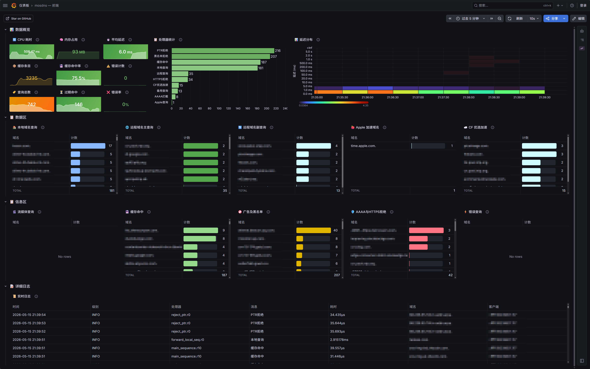

# mosdns — DNS 分流 + DNS 防漏 + Grafana 监控大屏方案

> **二创代码设计**：Jerrell &nbsp;|&nbsp; **代码助手**：DeepSeek &nbsp;|&nbsp; **许可**：[GPL v3.0](LICENSE)

基于 [mosdns](https://github.com/IrineSistiana/mosdns) v5 的 DNS 分流部署方案，配合 [OpenClash](https://github.com/vernesong/OpenClash) 实现零泄露代理。通过 Docker Compose 一键部署 Loki + Prometheus + Grafana 监控栈，提供 DNS 查询日志采集、实时指标监控等可视化面板。

---

<details>
<summary><b>📖 点击展开：Clash Redir-Host 零泄露配置详解 & 浏览器安全设置</b></summary>

## Clash 中 Redir-Host 及 Fake-IP 模式下零泄露的 DNS 怎么炼成？

两种模式的工作流：

| 模式 | 流程 | 规则匹配 |
|------|------|---------|
| **Fake-IP** | 客户端查询 → Clash 返回假 IP → 流量到达 → 还原域名 → 匹配规则 | 最终靠域名匹配 |
| **Redir-Host** | 客户端查询 → DNS 解析 → 拿到真 IP → 流量到达 → 根据 IP/域名匹配规则 | IP 和域名均可匹配 |

**Fake-IP** 实现零泄露的资料网上很多，不再展开。本方案聚焦 **Redir-Host**，因为部分软件（特别是 PT 下载）强制要求真实 DNS 解析，Fake-IP 不适用。而 mosdns 前端 + Redir-Host 模式的零泄露配置资料少、易踩坑。

### Redir-Host 下的 Clash 规则顺序

mosdns 前端模式下，国内域名在 mosdns 层已走 `forward_local` 拿到国内 IP，交到 Clash 的只有国外域名的国外 IP。因此 **GEOIP,CN 可以安全地排在 GEOSITE 前面**——匹配时先走 IP 层、再走域名层，国内 IP 一击直连，非 TLS 流量也能覆盖：

```yaml
rules:
  # ── 拒绝层 ──
  - RULE-SET, AWAvenue-Ads, REJECT

  # ── 直连白名单 ──
  - RULE-SET, LAN, DIRECT
  - RULE-SET, Direct, DIRECT

  # ── IP 层：国内 IP 直连（最快路径，覆盖非 TLS 流量）──
  - GEOIP,CN,DIRECT,no-resolve

  # ── 域名层（v2fly GeoSite 属性过滤）──
  # 国外站但有国内 CDN → 直连（如 steam CDN）
  - GEOSITE,geolocation-!cn@cn,DIRECT
  # 纯国外站 → 代理
  - GEOSITE,geolocation-!cn,🚩 默认策略
  # 国内站但仅国外可访问 → 代理（如 jd.hk）
  - GEOSITE,geolocation-cn@!cn,🚩 默认策略
  # 纯国内站 → 直连
  - GEOSITE,geolocation-cn,DIRECT
  # .cn TLD 兜底
  - GEOSITE,tld-cn,DIRECT

  # ── 兜底 ──
  - MATCH, 🚩 默认策略
```

> 必须使用 v2fly 原版 GeoSite（`geox-url.geosite: "https://testingcf.jsdelivr.net/gh/v2fly/domain-list-community@release/dlc.dat"`）。Loyalsoldier 分支已剔除 `@cn` / `@!cn` 属性，无法使用上述属性过滤写法。详见下方 GeoSite 属性过滤说明。

### 为什么其它教程把 GEOIP 放最后？

Fake-IP / 纯 Clash DNS 场景下，国外域名可能被国内 DNS 返回 CDN 代理的国内 IP（如 `www.google.com` 被阿里 CDN 代理）。如果 GEOIP 排在前面，Google 的国内 CDN IP 直接命中 DIRECT 直连，根本走不到域名代理规则——这就是泄露。标准教程把 GEOIP 放最后，让域名规则优先匹配，确保代理域名不被 IP 判断劫走。

**本方案不适用这条规则**——mosdns 已把 DNS 分流，国内域名走 ISP DNS、国外域名走 Clash DNS，不存在"国外域名拿到国内 CDN IP"的情况。

### GeoSite 属性过滤：精确分流的正确用法

GeoSite 常见的 `cn` 分组（Loyalsoldier 分支）实际上是 `geolocation-cn` + `tld-cn` + dnsmasq-china-list 的大杂烩。其中 dnsmasq-china-list 收录标准是有中国 NS 服务器，43% 的域名解析结果并不在中国。更麻烦的是，一些域名同时存在于 `geolocation-cn` 和 `geolocation-!cn` 两个冲突分组中。

**解决方案：使用 v2fly 原版 GeoSite + `@cn` / `@!cn` 属性过滤**

```yaml
# Clash geox-url 必须指向 v2fly 原版
geox-url:
  geosite: "https://testingcf.jsdelivr.net/gh/v2fly/domain-list-community@release/dlc.dat"
```

属性过滤的规则链逻辑：

```text
geolocation-!cn（整体是国外站，但部分有国内 CDN）
  ├─ @cn  筛选 → 国内 CDN 域名 → DIRECT（如 steam CDN、alibaba CDN）
  └─ 其余 → PROXY

geolocation-cn（整体是国内站，但部分只能国外访问）
  ├─ @!cn 筛选 → 国外才能访问 → PROXY（如 jd.hk）
  └─ 其余 → DIRECT

tld-cn（.cn 顶级域）→ DIRECT
```

这个写法利用了 GeoSite 的**树形规则**特性：`geolocation-!cn@cn` 自动包含了 `steam@cn`、`microsoft@cn` 等所有子分组的 `@cn` 域名，无需逐个手写。Loyalsoldier 分支因为剔除了 `@cn` / `@!cn` 属性，无法使用此写法。

> **DNS 分流配合**：Clash 的 `nameserver` 只配置国外 DoH，国内域名在 mosdns 层已走 ISP DNS。`proxy-server-nameserver` 建议加一个国内 DNS：
> ```yaml
> dns:
>   proxy-server-nameserver:
>     - 223.5.5.5
> ```
> 作用是 DoH 被墙时仍能解析代理服务器域名，防止连不上代理。

### Clash DNS 设置与防泄露

Clash 收到查询时会同时向 `nameserver` 和 `fallback` 发请求（竞速）。如果其中包含国内 DNS，它自己会用国内 DNS 解析国外域名——这就是泄露的根源。

mosdns 前端模式下 Clash DNS 应全部指向国外 DoH：

```yaml
dns:
  nameserver:
    - https://8.8.8.8/dns-query
    - https://1.1.1.1/dns-query
  fallback: []
  default-nameserver: 223.5.5.5
```

> **设为国外 DNS 会拖慢国内网速吗？** 不会。国内域名在 mosdns :53 层已走 `forward_local` → ISP DNS 直查返回，根本不进 Clash DNS。Clash 只处理 mosdns 判外的国外域名，且 DoH 查询走代理隧道加密，不经过本地 ISP。

### Sniffer 配置：保留 mosdns 的国内解析结果

Clash 的 sniffer 会影响 mosdns 前端模式的效果——嗅探拿到域名后如果触发 DNS 重新解析，mosdns 用 ISP DNS 解析出的中国 IP 就会被丢弃。

**破坏 mosdns 的三个参数联动：**

```text
parse-pure-ip: true         → 对纯 IP 连接也嗅探 TLS SNI，拿到域名
override-destination: true   → 将目标 IP 替换为域名，重新走 DNS 查找
force-dns-mapping: true      → 强制用 Clash DNS 缓存（DoH 结果）覆盖 IP
```

三者联动的后果：mosdns 给的 `119.0.110.63`（中国 IP）→ sniffer 嗅探到域名 → override 替换目标为域名 → Clash DoH 重新解析 → 从国外视角返回非中国 IP → `GEOIP,CN` 匹配失败。

**正确配置（前端模式下必须）：**

```yaml
sniffer:
  enable: true
  override-destination: false    # ← 嗅探域名仅用于规则匹配，不替换实际连接 IP
  force-dns-mapping: false       # ← 不强制用 Clash DNS 覆盖 mosdns 的解析结果
  parse-pure-ip: true            # ← 保留：让纯 IP 连接也能被嗅探（用于域名规则匹配）
  sniff:
    TLS:
      ports: [443, 8443, 8888, 9443]
    HTTP:
      ports: [80, 8080-8880]
```

改动后的流程：

```text
mosdns → 119.0.110.63 (中国 IP)
客户端发起 TCP 连接
Clash TUN 拦截
  ↓ sniffer 嗅探到域名（备用）
  ↓ 规则匹配：GEOIP,CN → 目标 IP 仍是 119.0.110.63 → 命中 DIRECT
  ↓ 实际连接直达 119.0.110.63，不再经 DoH 重新解析
```

> `parse-pure-ip: true` 保留是安全的——它只让嗅探器工作以提供域名给 GEOSITE 规则匹配，但 `override-destination: false` 保证实际 IP 不被替换。

---

## 实现DNS零泄露的另一个重要设置，务必关闭浏览器的"安全 DNS"

Chrome / Edge / Firefox 自带 DNS-over-HTTPS 功能，会绕过 mosdns 直接向 8.8.8.8 / Cloudflare 发加密查询，造成 DNS 泄露。

| 浏览器 | 操作路径 |
| ------ | -------- |
| **Chrome** | 设置 → 隐私和安全 → 安全 → 关闭"使用安全 DNS" |
| **Edge** | 设置 → 隐私、搜索和服务 → 安全 → 关闭"使用安全的 DNS 指定如何查找网站的网络地址" |
| **Firefox** | 设置 → 隐私与安全 → 取消"通过 HTTPS 启用 DNS" |

> Edge 如显示"托管浏览器禁用该设置"：地址栏输入 `edge://policy`，搜索 `DnsOverHttps`。若存在 `DnsOverHttpsMode: "secure"`，说明企业策略强制开启了 DoH，需在组策略或注册表中关闭。

---

### 推荐的 DNS 泄露测试站

| 测试站 | 可信度 | 说明 |
|--------|--------|------|
| **[dnsleaktest.com](https://dnsleaktest.com)** | **高** | 专项 DNS 检测，只测一项——域名查询从哪些 DNS 服务器出去。不混 WebRTC、不混 IP 检测，结果干净。**如果这里显示无泄露，就是没泄露。** |
| **[whoer.net](https://whoer.net)** | 中 | DNS 检测本身准确，但它期望所有查询从同一个 DNS 服务器出去。mosdns 把国内域名走本地 DNS、国外域名走 Clash DNS，会被标记为"脆弱的"——这不是泄露，是检测模型不认分 DNS 设计。看结果时**只盯 DNS 一栏**：列出的服务器没有国内地址就没泄露。 |

---

</details>

---

### ⚠️ 日志文件溢出风险

mosdns 的日志级别为 `info`，存放于 `/var/log/mosdns.log`。**客户端数量越多、网络使用越频繁，日志膨胀越快。** 路由器 `/var` 分区通常挂载于 tmpfs（内存），日志文件过大将**直接耗尽可用内存**，导致路由器死机或自动重启。

> **强烈建议**配置 crontab 自动清理，将日志大小始终控制在安全范围内。默认阈值为 2MB，每 6 小时检查一次：

```bash
# 添加 crontab（登录路由器执行）
echo '0 */6 * * * mosdns-cli clear 2' >> /etc/crontabs/root
/etc/init.d/cron restart
```

> 也可手动清理：`mosdns-cli clear`（立即清空）

---

### ⚠️ Docker 端磁盘占用

| 容器 | 存储 | 限制 |
|------|------|------|
| **Vector** | 无持久化（仅内存缓冲） | 可忽略 |
| **Loki** | `loki_data` 命名卷持久化 | **保留 72 小时**，compactor 自动清理过期 chunks |
| **Prometheus** | `prometheus_data` 命名卷 | 默认 15 天，TSDB 自动压缩 |
| **Grafana** | `grafana_data` 命名卷 | 面板配置，几 MB |

Loki 是唯一持续写入的服务。家庭网络（几百客户端）日均约 5-25 MB 原始日志，经 snappy 压缩后约 2-8 MB。72 小时保留 ≈ **30 MB 以内**，`docker compose down && up` 后数据不丢失。

---

## 本方案中提供两种Mosdns部署模式

两种模式共用同一个配置文件 `config_custom.yaml`，通过 `mosdns-cli mode` 命令切换：

| 模式 | 监听端口 | 国外 DNS | 国外域名延迟 | 国内域名延迟 | IP观察 |
| ---- | -------- | -------- | -------- | -------- | -------- |
| **后端模式** | :5335 | 路由器 WAN 直连 DoH | 低（WAN 直连 DoH） | 低 | 所有查询源地址127.0.0.1 |
| **系统前端** | :53 | `127.0.0.1:7874` → 代理隧道 | 中（代理隧道 + DoH，+30~50ms） | 最低 | 显示查询客户端的实际 IP 地址 |


```bash
mosdns-cli mode backend     # 切换到后端模式（DoH 上游）
mosdns-cli mode frontend    # 切换到前端模式（Clash DNS 上游）
# 切换自动热重载，保留 DNS 缓存
```
前后端模式流程对比：

```text
                         ─── 后端模式 ───                              ─── 前端模式 ───

  google.com           Client                                     Client
                           │                                          │
                           ▼                                          ▼
                       dnsmasq :53                               mosdns :53
                           │                                   ┌─ Step 1.5  AAAA 拦截
                           ▼                                   ├─ Step 12  geosite_no_cn
                       Clash DNS                               │  → forward_remote
                        ├─ nameserver: 127.0.0.1:5335           │  → 127.0.0.1:7874
                        └─ fallback:   127.0.0.1:5335           │
                           │                                      ▼
                           ▼                                  Clash DNS :7874
                       mosdns :5335                           nameserver: 8.8.8.8 DoH
                        Step 12: geosite_no_cn                    │
                        → forward_remote                          │── 代理隧道 ──┐
                        → 8.8.8.8 DoH (WAN 直连)                  │              │
                           │                                      ▼              │
                           ▼                                 返回 IP            │
                      返回 IP                                    │              │
                           │                                      ▼              │
                           ▼                                  mosdns ← IP       │
                       mosdns                                has_resp → accept  │
                        has_resp → accept                        │              │
                           │                                      ▼              │
                           ▼                                 客户端              │
                       Clash DNS 缓存                             │              │
                           │                                      ▼              │
                           ▼                                 TUN 截获            │
                       客户端                              SNIFFER: google.com  │
                           │                               redir-host 反查      │
                           ▼                                      │              │
                       TUN 截获                                    ▼              │
                    SNIFFER: google.com                   规则: RULE-SET,Proxy ─┘
                     redir-host 反查                              │
                           │                                      ▼
                           ▼                                 代理出口
                   规则: RULE-SET,Proxy ───────────────→     IP: 香港
                           │
                           ▼
                       代理出口
                       IP: 香港


  baidu.com            Client                                     Client
                           │                                          │
                           ▼                                          ▼
                       dnsmasq :53                               mosdns :53
                           │                                   Step 13: geosite_cn
                           ▼                                   → forward_local
                       Clash DNS                               ISP DNS 竞速 → IP
                        ├─ nameserver: 127.0.0.1:5335           → 客户端
                        └─ fallback:   127.0.0.1:5335              │
                           │                                      ▼
                           ▼                                 TUN 截获 → 域名反查
                       mosdns :5335                           GEOIP,CN ✓ → DIRECT
                        Step 13: geosite_cn
                        → forward_local
                        ISP DNS 竞速 → IP
                           │
                           ▼
                       Clash DNS 缓存 → 客户端
                           │
                           ▼
                       TUN 截获 → 域名反查
                       GEOIP,CN ✓ → DIRECT
```

---

## 架构

```text
OpenWrt 路由器 (192.168.11.1)          Docker 主机 (192.168.11.200)
┌────────────────────────────┐    ┌─────────────────────────────────┐
│  mosdns (:53 或 :5335)    │    │  vector (:9010/UDP)             │
│  ├─ DNS 分流 + 缓存       │    │  ├─ 接收日志 → 解析 → 中文映射  │
│  ├─ Prometheus :8338      │───▶│  └─ 直推 Loki (:3100)          │
│  └─ /var/log/mosdns.log   │    │                                 │
│       │                    │    │  Prometheus (:9090)             │
│       │ socat UDP ─────────┼───▶│  Grafana (:3000)               │
│       │                    │    └─────────────────────────────────┘
│  mosdns-log (procd)       │
│  tail -f → socat UDP      │
└────────────────────────────┘
```

| 环境 | 要求 |
| ---- | ---- |
| **路由器** | OpenWrt，已安装 mosdns v5 + socat |
| **Docker 主机** | Docker Engine 24+ / Docker Compose v2，与路由器局域网互通 |

| 组件 | 版本 |
| ---- | ---- |
| mosdns | v5 (OpenWrt 端) |
| Vector | `timberio/vector:latest-alpine` |
| Loki | `grafana/loki:3.4.3` |
| Prometheus | `prom/prometheus:latest` |
| Grafana | `grafana/grafana:latest` |

---

## 快速开始

<details open>
<summary><b>第一步：安装 mosdns（根据你路由器系统选择对应zip，这里只是示例）</b></summary>

```bash
wget https://github.com/IrineSistiana/mosdns/releases/latest/download/mosdns-linux-amd64.zip
unzip mosdns-linux-amd64.zip -d /usr/bin/
chmod +x /usr/bin/mosdns
```

> 推荐安装 [luci-app-mosdns](https://github.com/sbwml/luci-app-mosdns)，后续可使用其"GeoData 导出"功能、在线编辑规则列表及自动更新 Geo 数据功能。

**GeoData 导出功能模块中手动添加以下标签**：

```
GeoSite类: cn, apple, category-ads-all, geolocation-!cn, disney, hulu, netflix
GeoIP类:  cn, private
```

#### 没有 GeoData 时如何先跑起来

如果 GeoData 尚未导出，配置启动会因找不到规则文件而报错。先在两个目录创建所需空文件：

**`/var/mosdns/`**（GeoData 导出后自动覆盖，此处仅为首次启动占位）：

```bash
cd /var/mosdns
touch geosite_cn.txt geoip_cn.txt geosite_apple.txt geoip_private.txt \
      geosite_geolocation-!cn.txt geosite_category-ads-all.txt \
      geosite_disney.txt geosite_netflix.txt geosite_hulu.txt
```

**`/etc/mosdns/rule/`**（用户自行维护，不会自动生成）：

```bash
cd /etc/mosdns/rule
touch whitelist.txt blocklist.txt greylist.txt ddnslist.txt \
      hosts.txt redirect.txt streaming.txt cloudflare-cidr.txt \
      local-ptr.txt
```
启动成功后可通过 luci-app-mosdns 的"规则列表"功能在线编辑用户自行维护的这些文件。

特别说明：Luci-app-mosdns规则列表中的“PTR 黑名单”已改造为“错分广告域名删除名单”，所以初次使用请在luci-app-mosdns中将这个列表清空默认数据并保存。

**错分广告域名删除功能**（须通过 `mosdns-cli hook` 启用）：

GeoData 分类由社区维护，由于上游域名列表存在需要被移除的域名，所以引入需要移除的域名列表。效果是在Mosdns每次启动重建 geo 文件时自动清理错分域名：

| 文件 | 作用 | 目标 geo 文件 |
| ------ | ------ | ------------- |
| `local-ptr.txt` | 从广告列表删除 | `/var/mosdns/geosite_category-ads-all.txt` |

每行一个域名，`#` 开头为注释，例如添加：

```text
# 移除拦截这个域名，它影响飞书使用
mon.snssdk.com
# 移除拦截这个域名，它影响今日头条
ib.snssdk.com
```

`mosdns-cli hook` 自动注入钩子到 luci 的 `启动` 流程，移除勾子可执行 `mosdns-cli hook --remove`。

</details>

<details>
<summary><b>第二步：选择并部署配置</b></summary>

```bash
mkdir -p /etc/mosdns/rule /var/mosdns
```

#### 后端模式（Clash 在前，mosdns 在后）

Clash 端 → 插件设置 → DNS 设置 → 本地 DNS 劫持选「使用 Dnsmasq 转发」，转到覆写设置 → DNS 设置：将 nameserver 和 fallback 均指向 `127.0.0.1:5335`，取消其他 DNS 服务器。`default-nameserver` 设为 `223.5.5.5` 用于节点域名解析。

可在 DNS 覆写中启用 **Nameserver-Policy** 以进一步加速：

```yaml
"geosite:cn,private": [127.0.0.1:5335]
```

```bash
# 从示例配置复制
cp dashboard/mosdns/config/config_custom.yaml.sample my_config.yaml
# 编辑 my_config.yaml — 编辑末尾 MODE APPENDIX 的 JSON
# 重命名并上传
scp my_config.yaml root@192.168.11.1:/etc/mosdns/config_custom.yaml
```

#### 系统前端模式（mosdns 在前，接管 :53）

该模式下 mosdns 负责域名分类，国内直查、国外交 Clash DNS。架构清晰，能显著降低 OpenClash 因频繁处理 DNS 导致的 CPU 瞬时高负载。

**前置条件**：将 dnsmasq 监听端口改为 15335，mosdns 才能绑定 53。同时必须关闭 DNS 重定向，否则客户端 53 端口的查询会被防火墙劫持到旧 dnsmasq，永远到不了 mosdns。

```bash
# 修改 dnsmasq 端口并关闭 DNS 重定向
uci set dhcp.@dnsmasq[0].port='15335'
uci set dhcp.@dnsmasq[0].dns_redirect='0'
uci commit dhcp
/etc/init.d/dnsmasq restart
```

> LuCI 界面操作：网络 → DHCP/DNS → 常规 → **DNS 端口** 改为 15335，**DNS 重定向** 关闭。

部署配置（同上一步）后，执行模式切换：

```bash
mosdns-cli mode frontend  # 切换到前端模式（:53 + Clash DNS 上游）
```

> **重要**：Clash 端 → 插件设置 → DNS 设置 → 本地 DNS 劫持选「禁用」，转到覆写设置 → DNS 设置：将 nameserver 和 fallback 均指向国外 DoH（推荐 `https://8.8.8.8/dns-query` 和 `https://1.1.1.1/dns-query`）。`default-nameserver` 设为 `223.5.5.5` 用于 Clash 自身节点域名解析。

#### 部署前有两项配置需要手动完成

**① 本地 DNS 地址**——将配置文件拉到底部，找到 MODE APPENDIX 模块（JSON 格式）。`frontend` 和 `backend` 两种模式的国内 DNS 及可信 DNS 均在此处修改即可，**不要在配置文件上方直接改**，以免 YAML 缩进错误或破坏 `mode` 自动切换功能。搜索 `@MODE APPENDIX`，按注释提示修改下方的 JSON 内容：

```text
# ============================================================================
# MODE APPENDIX (mosdns-cli mode 命令使用 — 可手动编辑 JSON 自定义上游)
#
# 此段存放两种模式下的 forward 插件定义，作为 mode 切换的数据源。
# 脚本从此段提取 JSON → 按固定 YAML 格式规则生成插件块 → 替换配置正文。
#
# JSON 字段说明:
#   concurrent:           并发查询数（1=顺序, 2+=竞速）
#   upstreams:            上游 DNS 服务器列表
#     addr:               服务器地址（必填）
#     bootstrap:          DoH 域名解析引导（可选，仅 DoH 需要）
#     enable_pipeline:    HTTP/2 连接复用（可选，默认 false）
#     insecure_skip_verify: 跳过 TLS 证书验证（可选，默认 false）
#     idle_timeout:       连接空闲超时秒数（可选）
#
# 修改建议:
#   - 改 forward_local 换运营商 DNS 以获得最快 CDN
#   - 改 forward_remote 换 DoH 服务器或 Clash 端口
#   - 每个 upstream 至少需要 "addr" 字段，其他可选
#   - 编辑后执行 mosdns-cli mode <当前模式> 应用更改
# ============================================================================
```

**② Cloudflare 优选 IP**

利用 [CloudflareSpeedTest](https://github.com/XIU2/CloudflareSpeedTest) 测出你网络最快的几个 IP，通过 `mosdns-cli cf IP...` 写入配置文件。配置文件中 black_hole 的初始占位 IP 也是通过 `mosdns-cli cf` 管理，无需手动编辑配置文件。

> **为什么只用官方 CIDR 判断 Cloudflare IP，不用 GeoIP 数据**：
>
> `mosdns-cli` 下载的是 Cloudflare 官方宣告的 IP 段（`cloudflare.com/ips-v4/` + `ips-v6/`，约 30 条 CIDR），范围精确。
>
> GeoIP/GeoSite 的 Cloudflare 分类（AS13335）包含了 Cloudflare **所有客户的 IP**——CDN 节点、WARP 出口、Zero Trust 隧道端点等，范围比官方宣告宽 10 倍以上。用 GeoIP 数据做 `resp_ip` 匹配会误匹配大量非 Cloudflare 边缘节点的响应，替换到错误 IP 后客户端重试→触发错误解析路径→可能造成 DNS 泄漏。
>
> **结论**：`cloudflare_cidr` ip_set 始终使用 `mosdns-cli` 下载的官方 CIDR（`/etc/mosdns/rule/cloudflare-cidr.txt`），不要替换为 GeoIP 数据。

</details>

<details>
<summary><b>第三步：部署日志转发和控制工具</b></summary>

```bash
opkg update && opkg install socat

# 日志转发（procd 管理）
scp dashboard/mosdns/mosdns-log root@192.168.11.1:/etc/init.d/
chmod +x /etc/init.d/mosdns-log

# mosdns 控制工具
scp dashboard/mosdns/mosdns-cli root@192.168.11.1:/usr/bin/
chmod +x /usr/bin/mosdns-cli

# 如 Docker 主机 IP 非 192.168.11.200，需修改
vi /etc/init.d/mosdns-log   # 改 DOCKER_HOST="你的IP"

/etc/init.d/mosdns-log enable
/etc/init.d/mosdns-log start
```

</details>

<details>
<summary><b>第四步：启动 mosdns</b></summary>

```bash
# 命令行启动（用于测试配置格式）
mosdns start -c /etc/mosdns/config_custom.yaml -d /etc/mosdns

# 确认无报错后，推荐改用 luci-app-mosdns "自定义配置"功能启动（勾选"启用"即可）
```

</details>

<details>
<summary><b>第五步：部署 Docker 监控栈</b></summary>

在 Docker 主机上执行：

```bash
cd dashboard
# 如果 mosdns 不在 192.168.11.1:8338，需先修改 docker-compose.yaml 中 PROMETHEUS_TARGET 地址
docker compose up -d
docker compose ps   # 确认所有服务状态为 healthy/running，确保部署成功
```
</details>

<details>
<summary><b>第六步：访问 Grafana 面板</b></summary>

mosdns监控大屏已预配到grafana，部署完成后浏览器访问 `http://<DockerIP>:3000/d/mosdns`</details>

---

## DNS 分流逻辑

main_sequence 按优先级执行 14 步，每步后检查是否有响应：

```text
Step 1      指标采集                  Prometheus 埋点
Step 1.5    AAAA 拦截                 白名单排除法（ipv6 命令控制）
Step 2      黑名单 / PTR / HTTPS      直接拒绝
Step 3      广告域名                  拒绝
Step 4      hosts 文件                本地静态解析
Step 5      redirect                  重定向
Step 6      缓存查找                  命中则直接返回
Step 7      Apple 域名                国内 DNS 竞速 + 114 备用
Step 8      DDNS                      强制国内 DNS
Step 9      白名单                    强制国内 DNS
Step 10     流媒体                    专用远程线路
Step 11     灰名单                    远程 DNS（防污染）
Step 12     国外域名 (geosite_no_cn)  远程 DNS
Step 13     国内域名 (geosite_cn)     国内 DNS 池竞速
Step 14     兜底                      主备竞速
```

每步后 `jump has_resp_sequence`：有响应 → TTL 处理 → CF 优选 → 返回；无响应 → 继续下一步。

#### Step 7 Apple 域名工作流

```text
Apple 域名
  ├─ 本地 DNS 返回国内 IP  → 采纳（国内 CDN 最快）
  ├─ 本地 DNS 返回国外 IP  → drop → 采纳 114 DNS 结果
  └─ 本地 DNS 超时 >100ms → 采纳 114 DNS 竞速结果
```

> Apple 域名的目标是**最快国内 CDN**，非防泄露。两端模式均使用 `always_standby: true` 并行竞速，本地 DNS 和 114 DNS 谁快用谁。Apple 域名本身不被墙，114 DNS 查询不存在隐私问题。


### 配置对比

两种模式由同一配置文件 + `mosdns-cli mode` 命令管理。切换自动热重载，保留 DNS 缓存：

| 项目 | 后端模式 | 前端模式 |
| ---- | -------- | -------- |
| mosdns 监听 | :5335 | :53 |
| dnsmasq 监听 | :53 | :15335（已让位） |
| 国外 DNS 出口 | 路由器 WAN → DoH 直连 | Clash DNS → 代理隧道 → DoH |
| DNS 加密层数 | 单层 TLS | 代理加密 + TLS（双层） |
| 国外延迟 | 低（WAN 直连） | 中（+30~50ms 隧道往返） |
| 国内延迟 | 低（ISP DNS 直查） | 低（ISP DNS 直查，不进 Clash） |
| whoer.net DNS | DNS IP ≠ 代理 IP（不一致） | DNS IP = 代理 IP（一致） |
| Clash 配置 | 简单（nameserver → mosdns） | 中等（需关 IPv6 DNS 等） |
| AAAA 拦截 | mosdns `ipv6` 命令 | mosdns + Clash `IPV6_DNS=0` 双重 |
| 适合场景 | 追求最低延迟，不在意 whoer 检测 | 需要 DNS/代理 IP 一致，灵活切换 |

---

## 面板一览

面板分为 4 行共 24 面板，数据概览行为 Prometheus 指标统计，数据区/信息区为 Loki 日志分类表格，详细日志行为全量日志流。

### 📊 数据概览（11 面板，始终展开）

| 面板 | 数据来源 | 指标 / 筛选 | 说明 |
| ---- | -------- | ----------- | ---- |
| 🔄 CPU 耗时 | Prometheus | `process_cpu_seconds_total` | mosdns 进程在时间范围内的 CPU 秒数 |
| 🧠 内存占用 | Prometheus | `process_resident_memory_bytes` | mosdns 进程内存使用量 |
| ⏱️ 平均延迟 | Prometheus | `response_latency_millisecond_sum / _count` | DNS 查询算术平均响应延迟 |
| 📋 处理器统计 | Loki | `{app="mosdns"}`, 按 message_zh 聚合 | 各处理器命中次数分布 |
| 📊 延迟分布 | Prometheus | `response_latency_millisecond_bucket` | 响应延迟热力图 |
| 📦 缓存条目 | Prometheus | `cache_size_current{tag="lazy_cache"}` | 当前缓存域名数量 |
| 💾 缓存命中率 | Prometheus | `cache_hit_total / cache_query_total` | 缓存命中比例 |
| ⚠️ 错误计数 | Prometheus | `err_total` | 区间内查询错误次数 |
| 🏷️ 查询总数 | Prometheus | `query_total` | 区间内 DNS 查询总量 |
| ⏳ 过期命中 | Prometheus | `cache_lazy_hit_total` | TTL 过期后复用旧缓存值的次数 |
| ❌ 错误率 | Prometheus | `err_total / query_total` | 查询失败占比 |

### 📋 数据区（6 面板，默认展开）

| 面板 | 数据来源 | 筛选条件 | 说明 |
| ---- | -------- | -------- | ---- |
| 🏠 本地域名查询 | Loki | `message == "forward_local"` | 使用国内 DNS 直查的域名 |
| 🌐 远程域名主查询 | Loki | `message == "forward_remote"` | 使用无污染 DNS (DoH/Clash) 查询的域名 |
| 🔄 远程域名副查询 | Loki | `message == "fallback_remote"` | 远程主查失败后由 Cloudflare DoH 兜底的域名 |
| 🍎 Apple 加速域名 | Loki | `message == "apple_fallback"` | 被 114 DNS 加速的 Apple 域名 |
| ☁️ CF 优选加速 | Loki | `message == "cloudflare_accel"` | Cloudflare IP 被替换为优选 IP 的域名 |
| 🎬 流媒体查询 | Loki | `message == "forward_stream_media"` | 使用专用流媒体 DNS 查询的域名 |

### 📋 信息区（6 面板，默认折叠）

| 面板 | 数据来源 | 筛选条件 | 说明 |
| ---- | -------- | -------- | ---- |
| 💾 缓存命中 | Loki | `message == "cache"` | DNS 查询命中本地缓存，直接返回 |
| 🚫 广告及黑名单 | Loki | `message == "reject_blocklist"` | 被拦截的广告及黑名单域名 |
| 🛡️ AAAA与HTTPS拒绝 | Loki | `message =~ "reject_(aaaa\|https)"` | 被 AAAA (qtype 28) 及 HTTPS (qtype 65) 规则拒绝的域名 |
| 📝 Hosts 本地解析 | Loki | `message == "hosts"` | 通过 hosts.txt 静态解析的域名，内存查表无网络请求 |
| ↩️ Redirect 重定向 | Loki | `message == "redirect"` | 通过 redirect.txt 重定向到特定 IP 的域名，支持通配符 |
| ⚡ 错误查询 | Loki | `message == "upstream error"` | 上游 DNS 返回错误或超时 |

### 📝 详细日志（1 面板，始终展开）

| 面板 | 数据来源 | 筛选条件 | 说明 |
| ---- | -------- | -------- | ---- |
| 📜 实时日志 | Loki | `{app=~"mosdns.*"}` | 全量 DNS 查询及系统日志流 |

### 数据流向

```text
mosdns 日志文件                      Vector (VRL 解析 + message_zh 映射)
     │                                        │
     ├─ query_summary forward_local ──────▶ message="forward_local"  → 本地查询
     ├─ query_summary forward_remote ─────▶ message="forward_remote" → 远程查询
     ├─ query_summary fallback_remote ────▶ message="fallback_remote"→ 远程副查询
     ├─ query_summary apple_fallback ─────▶ message="apple_fallback" → Apple加速
     ├─ query_summary cloudflare_accel ───▶ message="cloudflare_accel"→ CF优选
     ├─ query_summary forward_stream_media▶ message="forward_stream_media"→流媒体
     ├─ query_summary hosts ───────────────▶ message="hosts"           → Hosts解析
     ├─ query_summary redirect ────────────▶ message="redirect"        → 重定向
     ├─ query_summary cache ──────────────▶ message="cache"          → 缓存命中
     ├─ query_summary reject_blocklist ───▶ message="reject_blocklist"→广告黑名单
     ├─ query_summary reject_aaaa ────────▶ message="reject_aaaa"    → AAAA拦截
     ├─ query_summary reject_https ───────▶ message="reject_https"   → HTTPS拒绝
     ├─ forward 插件连接失败 ──────────────▶ message="upstream error" → 错误查询
     └─ Prometheus /metrics (:8338) ──────▶ CPU/内存/缓存/延迟 等 11 项指标
```

---

## 常用操作

### 启动与停止

```bash
mosdns-cli start      # 启动 mosdns + 日志转发
mosdns-cli stop       # 停止 mosdns + 关闭日志转发
mosdns-cli reload     # 热重载 mosdns 配置（保留 DNS 缓存）
```

### Cloudflare CIDR 与优选 IP

```bash
mosdns-cli cf                                   # 关闭 CF 优选 IP 替换
mosdns-cli cf 104.18.33.173 104.18.228.160      # 下载 CIDR，开启 CF 优选并写入 black_hole IP
                                                # IP 来自 CloudflareSpeedTest 测速结果
```

### 缓存管理

```bash
mosdns-cli flush                                                # 清空缓存
```

### IPv6 AAAA 拦截

在 `main_sequence` Step 1.5 通过**白名单排除法**集中控制 AAAA 拦截。原理：所有 AAAA 查询默认拒绝，仅明确放行的域名类别（geosite_cn / Apple / 白名单 / DDNS）可通过。改完自动热重载。

```bash
mosdns-cli ipv6              # 全部放行 AAAA，IPv6 正常使用
mosdns-cli ipv6 --local      # 仅国内查询拦截 AAAA（IPv4-only）
mosdns-cli ipv6 --remote     # 仅国外查询拦截 AAAA（防 IPv6 DNS 泄漏）
mosdns-cli ipv6 --dual       # 国内+国外均拦截 AAAA
```

| 子参数 | --remote 规则 | --local 规则 | 效果 |
| ------ | :---: | :---: | --- |
| 无参 | 注释 | 注释 | 全球 IPv6 放行 |
| `--local` | 注释 | **启用** | 仅 geosite_cn 域名的 AAAA 被拒绝 |
| `--remote` | **启用** | 注释 | 除 cn/Apple/白名单/DDNS 外的域名 AAAA 均拒绝 |
| `--dual` | **启用** | **启用** | 全球 AAAA 拦截 |

> **`reject_aaaa` 与 `prefer_ipv4` 的关系**：两者互补，非竞合。
>
> - `reject_aaaa`（ipv6 命令）：在**查询前**集中拦截——`matches: qtype 28` + 白名单排除法命中后直接拒绝。用于防 DNS 泄漏。
> - `prefer_ipv4`（forward_*_upstream 序列）：在**响应后**筛选——AAA 查询已发出并收到响应，检测域名双栈后抑制 AAAA 结果。纯 IPv6 单栈域名不受影响。
>
> 两个插件工作在不同阶段，不冲突。打开配置文件查看 `Step 1.5` 注释可了解具体匹配逻辑。

### 模式切换

两种模式共用同一配置文件，切换自动热重载、保留 DNS 缓存。切换后配置文件顶部 `# 当前模式: xxx` 注释同步更新，便于确认当前模式。

```bash
mosdns-cli mode backend     # 切换到后端模式（DoH 上游，:5335）
mosdns-cli mode frontend    # 切换到前端模式（Clash DNS 上游，:53）
```

### 广告过滤

```bash
mosdns-cli adlist              # 启用广告过滤
mosdns-cli adlist --remove     # 关闭广告过滤
```

### DNS 透明劫持（一般配合clash的tun使用时不开）

阻止局域网内硬编码 DNS 的设备绕过 mosdns。

```bash
mosdns-cli dns                 # 启用劫持
mosdns-cli dns --remove        # 拆除劫持
```

### Geo 文件错分域名清理功能

```bash
mosdns-cli hook                # 注入钩子
mosdns-cli hook --remove       # 拆除钩子
```

### 日志清理

```bash
mosdns-cli clear        # 立即清空
mosdns-cli clear 2      # 日志 ≥ 2MB 时清空
mosdns-cli clear 10     # 日志 ≥ 10MB 时清空
```

> 建议配置 crontab 自动清理日志，防止写满 `/var`：

```bash
# 每 6 小时检查一次，日志 ≥ 2MB 则清空
0 */6 * * * mosdns-cli clear 2
```

## 故障排查

| 症状 | 排查方法 |
| ---- | -------- |
| 面板无数据 | `ps \| grep mosdns-log` 确认运行中；`docker compose ps` 确认容器状态 |
| CPU 占用高 | `ps \| grep -E "mosdns\.log\|socat.*9010"` 检查残留进程 |
| DNS 解析慢 | `time nslookup baidu.com 127.0.0.1` 测试延迟；检查缓存命中率面板 |
| 回滚配置 | YAML 缩进严格，代码上千行排查费眼。建议从 GitHub 重新拉取 `config_custom.yaml` 后重做修改 |

## 目录结构

```text
mosdns/
├── README.md
├── LICENSE
├── snapshot.png
├── dashboard/
│   ├── docker-compose.yaml
│   ├── vector/config.yml
│   ├── loki/loki-config.yaml
│   ├── prometheus/prometheus.yml
│   ├── provisioning/
│   │   ├── dashboards/default.yaml  # 面板预配配置
│   │   └── datasources/ds.yaml      # 数据源预配配置
│   ├── panel/
│   │   └── panel.json              # Grafana 面板 (uid: mosdns)
│   └── mosdns/
│       ├── config/
│       │   └── config_custom.yaml.sample          # 通用配置示例
│       ├── mosdns-log              # 日志转发脚本
│       └── mosdns-cli              # mosdns 控制工具
```


## 参考资料

- [mosdns v5](https://github.com/IrineSistiana/mosdns)
- [luci-app-mosdns](https://github.com/sbwml/luci-app-mosdns)
- [OpenClash](https://github.com/vernesong/OpenClash)
- [Loyalsoldier](https://github.com/Loyalsoldier/v2ray-rules-dat)
- [虚空终端 Docs](https://wiki.metacubex.one/config/)
- [Cloudflare 优选 IP](https://github.com/XIU2/CloudflareSpeedTest)
- [Vector + Loki 实现 mosdns 数据看板](https://icyleaf.com/2023/08/using-vector-transform-mosdns-logging-to-grafana-via-loki/#prometheus)
- [mosdns_docker](https://github.com/Jasper-1024/mosdns_docker)
- [Clash 中 GeoSite 分流的正确使用方式](https://www.aloxaf.com/2025/04/how_to_use_geosite/)


